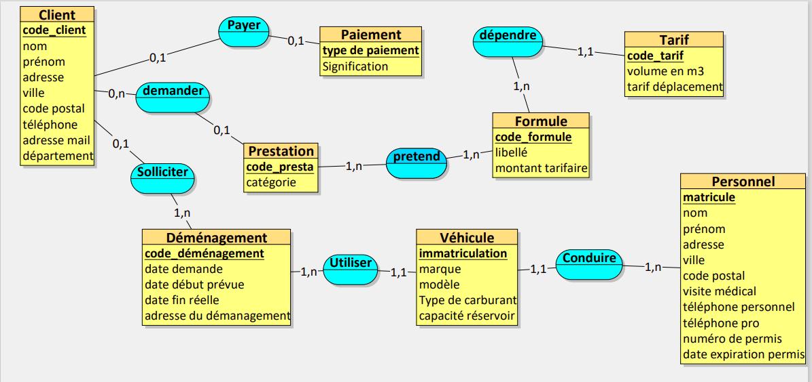

# avec 1 dièse, Titre Niveau 1
## avec 2 dièses, Titre Niveau 2
### avec 3 dièses, Titre Niveau 3

> Avec 1 chevron, Citation niveau 1
>> Avec 2 chevrons, Citation niveau 2

**Entre 2 astérisques, Texte en gras**

_Entre 1 underscore, titre en italique_

```
    Entre 3 accents graves, du code, comme des lignes de commandes

```

# Sommaire 
- [avec 1 dièse, Titre Niveau 1](#avec-1-dièse-titre-niveau-1)
  - [avec 2 dièses, Titre Niveau 2](#avec-2-dièses-titre-niveau-2)
    - [avec 3 dièses, Titre Niveau 3](#avec-3-dièses-titre-niveau-3)
- [Sommaire](#sommaire)
  - [test](#test)
    - [testttt](#testttt)
- [Base de données](#base-de-données)


## test
### testttt


# Base de données



